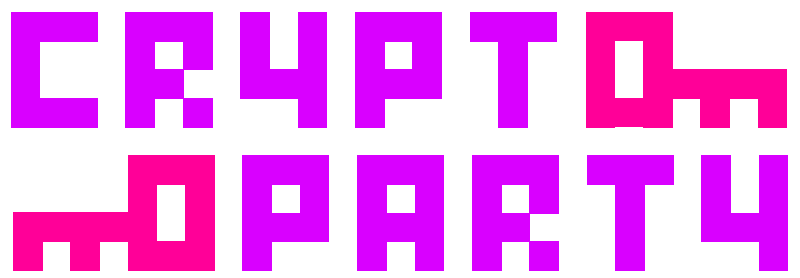

% 
% <strong>Eine Einführung</strong>
% {{Speaker Name}} — {{Month}} {{Date}}, {{Year}}

# Ablauf

- Kurze Einführung
- Fragen, Fragen, Fragen und Themen
- Thementeile
- Klicken, Helfen, Installieren

# Vorstellung

- Team
- Ort

# Motivation

Privatheit herstellen
- Recht auf Informationelle Selbstbestimmung

<quote>„<strong>Die Regierung kann deine Daten nicht schützen</strong>”
  ~ Im Gespräch: CSU-Politiker Uhl, FAZ, 17.07.2013</quote>

<quote>„Bundesinnenminister Hans-Peter Friedrich […] rief die Deutschen dazu auf, <strong>selbst mehr für den Schutz ihrer Daten zu tun</strong>.”  
  ~ Spiegel Online 2013-07-16</quote>

<quote>
„Privacy is <strong>necessary for an open society</strong> in the electronic age.” 
„Privacy is the power to <strong>selectively reveal</strong> oneself to the world” 
   ~[Cypherpunk Manifesto](http://www.activism.net/cypherpunk/manifesto.html)
</quote>

# Werkzeugkasten

- hier: eine Lösung pro Problem (der Einfachheit halber)

<table style="border-width:2pt">
<tr><td>Email</td><td>Thunderbird, Enigmail, GnuPG</td></tr>
<tr><td>Chat</td><td>Pidgin, OTR-Plugin</td></tr>
<tr><td>Anonymes Internet</td><td>TorBrowserBundle</td></tr>
<tr><td>Datenspeicher</td><td>Truecrypt</td>
<tr><td>Schlüsselverwaltung</td><td>Seamonked</td></tr>
<tr><td>VPN</td><td>(…erst mal nicht)</td></tr>
</table>

# Open Source

- „Free Software”, nicht Freibier 
-- Peer-Review schafft Funktionssicherheit

# Sicherheitsziele

<ul>
<li>Privatheit</li>
<li>Vertraulichkeit</li>
<ul><li>Inhalt</li>
<li>Kommunikations-/Metadaten (Sender, Absender, Zeit)</li>
</ul>
<li>Integrität</li>
<li>Authentizität</li>
<ul><li>Nie wieder Spam?</li>
</ul>
</ul>

# Privatheit

- „Wenn du nichts zu verbergen hast, dann hast du auch nichts zu befürchten.”
- Grundrecht auf informationelle Selbstbestimmung (BVerfG 1983)
- Beobachtung ändert Verhalten

Gefährdung durch:
- Cookies, CCTV, Metadata, 
- Social Networks, Suchmaschinen, ISP

Gegenmaßnahmen:
- Datensparsamkeit 
- Kryptographie/Inhaltsverschlüsselung 
- Anonymisierdienste
- Verschlüsselte Speichermedien

# Security vs Privacy

# Anonymität

- Aktionen und Person sind nicht zuzuordnen
- Sender-/Empfängeranonymität
- Pseudonyme 
- Verkettbarkeit von Pseudonymen schaffen Identität
- Tor, Bitcoin, Freenet

# Authentifikation

- „Sichere Identität” schafft Kontinuität
- Grundlage für Vertrauen/Beziehungen
- Identitäten (Email/IP-Adresse) sind nicht authentisch
- Grundlegende Methode: Public-Key Kryptographie

- PGP (GnuPG), TLS, S/MIME

# Integrität

- Inhalt kann nicht unbemerkt verändert

# Was ist "Crypto"?

Cryptography ist:

- Ein Haufen komplizierte Mathematik
- Grundlage für viele Sicherheitsmechanismen

Cryptography ist nicht:

- Ersatz für vernünftiges Handeln (OPSEC)
- Einfach zu programmieren
- Leicht selbst zu erfinden

# Crypto + Party = Cryptoparty

# What Next?

